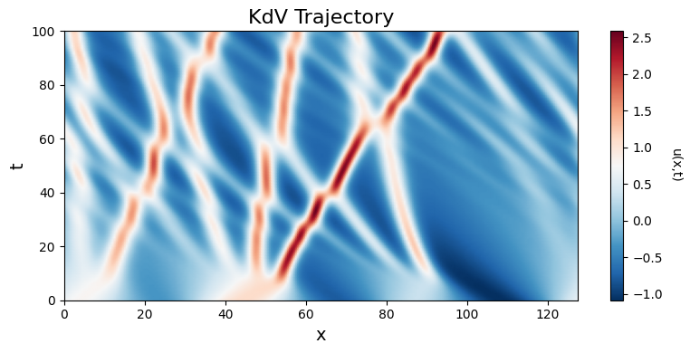
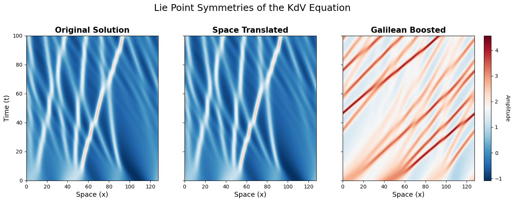
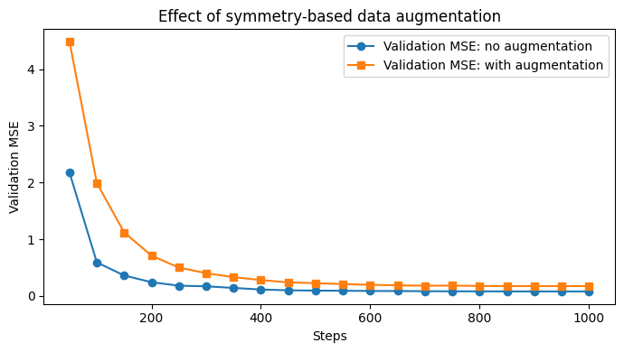

# Group Equivariant Learning

This project explores group theory and equivariance in deep learning, with applications to partial differential equations (PDEs), particularly the Korteweg–de Vries (KdV) equation.

## Overview

We study how symmetry and group actions can be used to improve learning systems. The project combines theoretical concepts from linear algebra and group theory with practical implementations in deep learning.

## Topics Covered

- Special Linear Group (SL(d))
- Orthogonal Group (O(d))
- Group Representations
- Group Averaging
- Nonlinear Equivariance
- KdV Equation and Lie Symmetries
- Symmetry-based Data Augmentation
- Neural Network Training (FNO)

## Results

### KdV Trajectory
Spatiotemporal evolution of the KdV equation solution.

---

### Symmetry Transformations
Visualization of Lie point symmetries (space translation and Galilean transformation).

---

### Model Comparison
Effect of symmetry-based data augmentation on validation performance.

## Implementation

- Python
- NumPy, SciPy
- PyTorch
- Pseudospectral methods for PDEs

## Key Insight

This project demonstrates how incorporating symmetry into machine learning models can influence generalization and model behavior.

---

## Repository Structure
.

---

## Author

Maria
